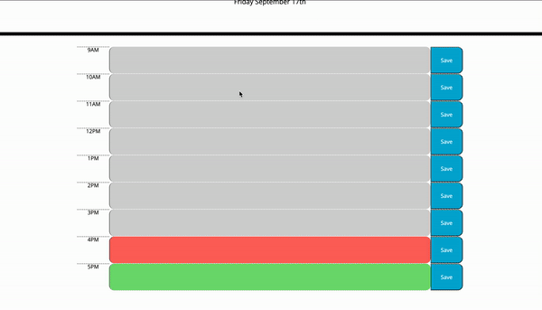

# work-day-planner

This is a simple work day planner incorporating jQuery API, Bootstrap, and Moment.js. This application allows its user to log and keep track of their various tasks throughout the work day, 9AM to 5PM.

## Table of Contents

- [Installation](#installation)
- [Usage](#usage)
- [Credits](#credits)
- [License](#license)

## Installation

To run a copy of this app on your local machine, first clone the repository:

HTTPS:

```
$ git clone https://github.com/LauraCole1900/jQueryWorkdayScheduler.git
```

SSH:

```
$ git clone git@github.com:LauraCole1900/jQueryWorkdayScheduler.git
```

Then cd into the directory into which you cloned, right-click on index.html, and choose "Open in default browser."

## Usage

This page can be accessed and used on any standard web browser. The user is able to see the current date at the top of the page. On the planner itself, hourly time blocks are color coded based on whether they are in the past, present, or futre. The user is able to type in their tasks for the work day in their desired time block, and click the adjacent "Save" button to save their entries. By clicking "Save", the information will remain on the application even if the page is refreshed or the browser is closed and reopened.

## Credits

The documentation for [Bootstrap](https://getbootstrap.com/docs/4.5/getting-started/introduction/), [jQuery API](https://api.jquery.com/), and [Moment.js](https://momentjs.com/docs/) were most helpful in setting up the layout and functionality of this application.

## License

Creative Commons License: This work can be used by others as long as credit is given.



The application can be viewed here: [https://liaobrien.github.io/work-day-planner/](https://liaobrien.github.io/work-day-planner).
